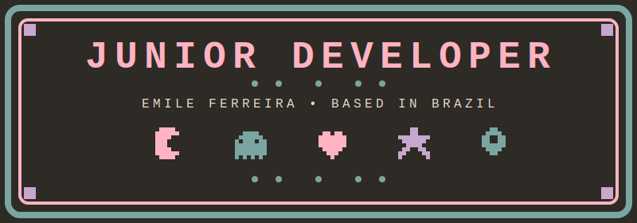
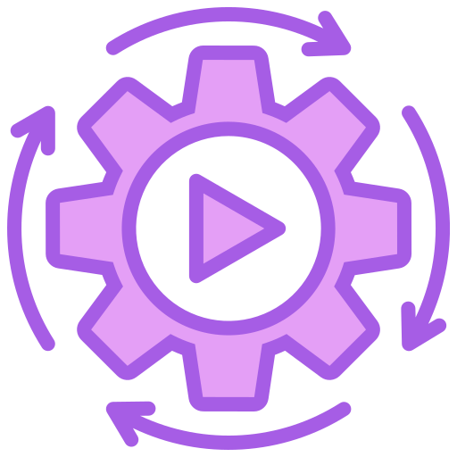

  

  

  
  

---

<h2 style="text-align:left; background: linear-gradient(90deg, #FFFFFF 0%, #FFE3EC 100%); padding: 8px 12px; border-radius: 8px;">
  
  ABOUT ME
</h2>

<table>
<tr>
<td width="50%" valign="top">
<h3>
  
  MY EXPERIENCE
</h3>

<b>Backend-focused developer with practical experience in automations, APIs and technical support.</b>
I enjoy building reliable web solutions and integrated flows, while constantly improving my
front-end, back-end and automation skills.  

<b>Core strengths:</b> 

Backend-first mindset with experience in REST APIs and data modeling. 

Hands-on with integrations, webhooks and workflow automation. 

Comfortable working across the stack when needed (front-end, back-end and infra support).
</td>

<td width="50%" valign="top">
<h3>
  
  SKILLS
</h3>

<b> WEB DESIGN</b> 
 Modern Layouts &amp; Responsive Design 
 Clean Navigation &amp; Visual Storytelling  

<b> AUTOMATION &amp; TOOLS</b> 
 Web Automation &amp; Bot Development 
 API Integration &amp; Script Building 
 Workflow Optimization &amp; Low-Code Solutions  

<b> DEVELOPMENT</b> 
 Full-Stack Development (Front-end + Back-end) 
 Optimization &amp; Support 
 Clean Programming &amp; Architecture Design
</td>
</tr>
</table>

---

<table>
<tr>
<td width="60%" valign="top" style="padding: 16px;">

<h2 style="text-align:left; background: linear-gradient(90deg, #FFFFFF 0%, #FFE3EC 100%); padding: 8px 12px; border-radius: 8px; margin-top:0;">
  
  TECH STACK
</h2>

<h3>Technologies &amp; Infrastructure</h3>

</td>

<td width="40%" valign="top" style="padding: 16px;">

<h2 style="text-align:left; background: linear-gradient(90deg, #FFFFFF 0%, #FFE3EC 100%); padding: 8px 12px; border-radius: 8px; margin-top:0;">
  
  LANGUAGES
</h2>

  

</td>
</tr>
</table>

---

<h2 style="text-align:left; background: linear-gradient(90deg, #FFFFFF 0%, #FFE3EC 100%); padding: 8px 12px; border-radius: 8px;">
  
  ACHIEVEMENTS
</h2>

  

<h2 style="text-align:left; background: linear-gradient(90deg, #FFFFFF 0%, #FFE3EC 100%); padding: 8px 12px; border-radius: 8px;">
  
  MY PROJECTS
</h2>

<table>
<tr>

<td align="center" width="50%" style="padding: 12px;">
<h3>
  
  <a href="https://github.com/mcemy/fnaf-inspired-overcooked-game">
    FNAF Game
    
  </a>
</h3>
<b>Freddy na cozinha!</b> Um Overcooked retrô com pizzas, 
correria e muita diversão.
</td>

<td align="center" width="50%" style="padding: 12px;">
<h3>
  
  <a href="https://github.com/mcemy/Texto-para-voz">
    Texto para Voz
    
  </a>
</h3>
<b>Text-to-speech converter</b> with modern interface. 
Clean implementation focused on accessibility and usability.
</td>

</tr>
</table>

---

<h2 style="text-align:left; background: linear-gradient(90deg, #FFFFFF 0%, #FFE3EC 100%); padding: 8px 12px; border-radius: 8px;">
  
  BEYOND CODE
</h2>

<table>
<tr>
<td align="center" width="50%" style="padding: 12px;">
<h3>
   FAVORITE GAMES
</h3>

 
<b>MINECRAFT</b> Building worlds, one block at a time  
 
<b>THE SIMS</b> Creating stories through simulation
</td>

<td align="center" width="50%" style="padding: 12px;">
<h3>
   FAVORITE MUSICS
</h3>

<table>
<tr>
<td align="center" width="200" style="padding: 8px;">
 
<b>Poison Ivy</b> - <i>Ivy</i> 

</td>

<td align="center" width="200" style="padding: 8px;">
 
<b>차 차</b> - <i>eugene</i> 

</td>
</tr>
</table>
</td>
</tr>
</table>

---

<h2 style="text-align:left; background: linear-gradient(90deg, #FFFFFF 0%, #FFE3EC 100%); padding: 8px 12px; border-radius: 8px;">
  
  CONTRIBUTION ACTIVITY
</h2>

 

---

